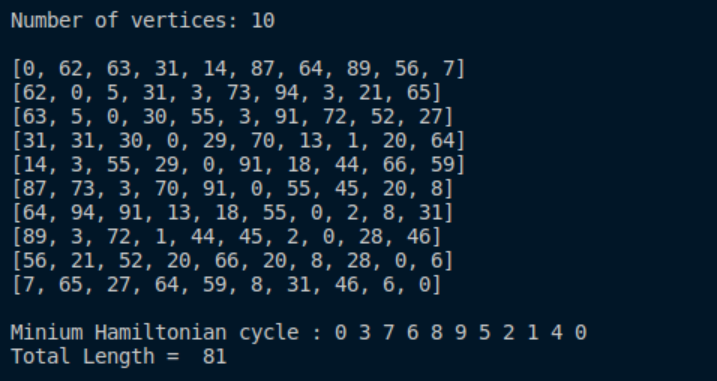
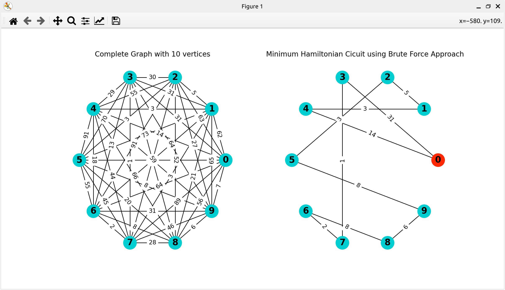
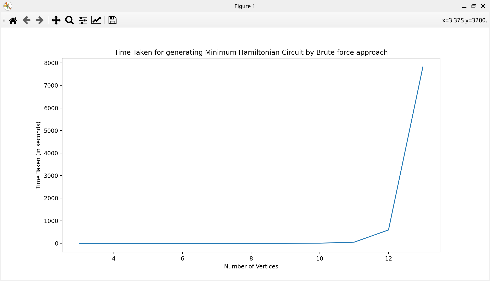

#CSPE32 Project

#Language used\
 -The project is entirely done in Python.
 
#Project Description

 #Minimum Spanning Tree\
 -Prim's Algorithm: A vertex is chosen as the starting node in a graph with n nodes. The cheapest edge at the vertex is added to the tree. Next, the algorithm looks for the next cheapest edge connected to the vertices in the tree and checks if a cycle is formed in the tree. If a cycle is formed, it does not add the edge to the tree and goes for the next cheapest edge. Else, it adds the edge and new vertex to the tree and looks for the next cheapest edge. This process ends when there n-1 edge in the tree.

 #Bruteforce algorithm to find Minimum Hamiltonian cycle in complete graph\
 -This algorithm finds every hamiltonian cycle and its weight and displays the Hamiltonian Cycle with the least weight.\
 \
 
 
 #Bruteforce Vertices vs Time\
 -The bruteforce algorithm is not advised for finding minimum hamiltonian graph due to the time complexity being O(n!) since there are (n-1)!/2 possible hamiltonian cycles for a complete graph.
 
 
#Credits\
 -Bharat Jude Johnson-106121027,\
 -Nitish N-106121087,\
 -R Pranav Kumar-106121109,\
 -Venkatesh A-106121141.
