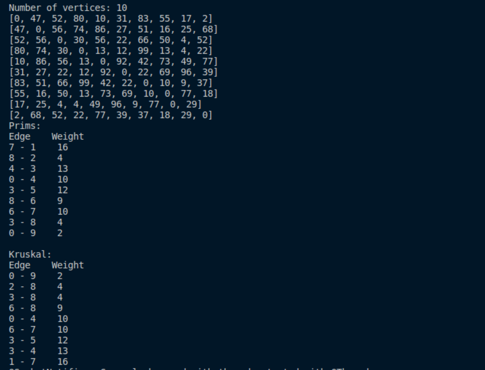
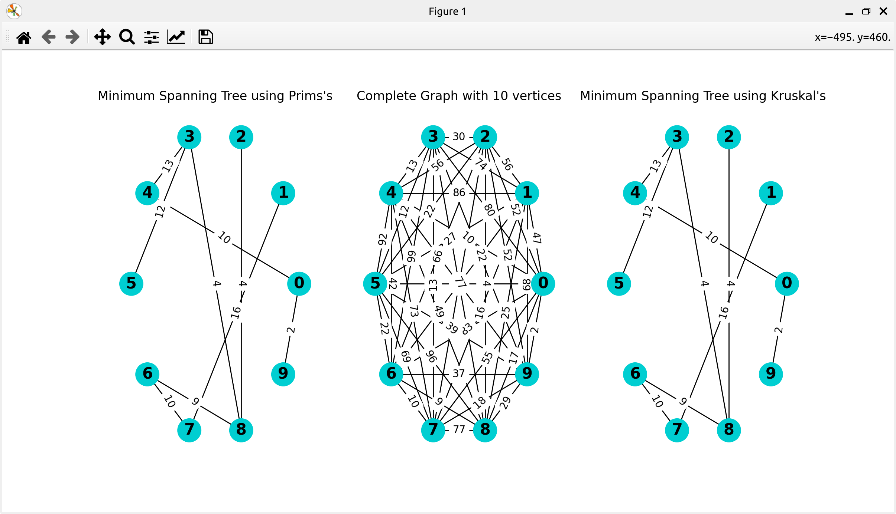
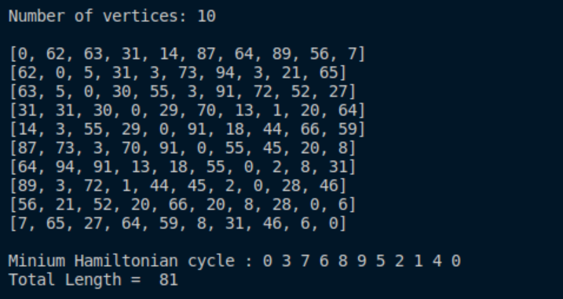
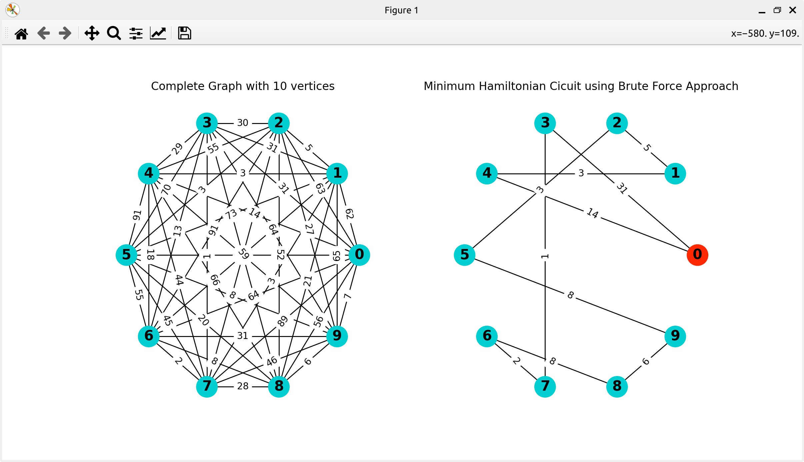
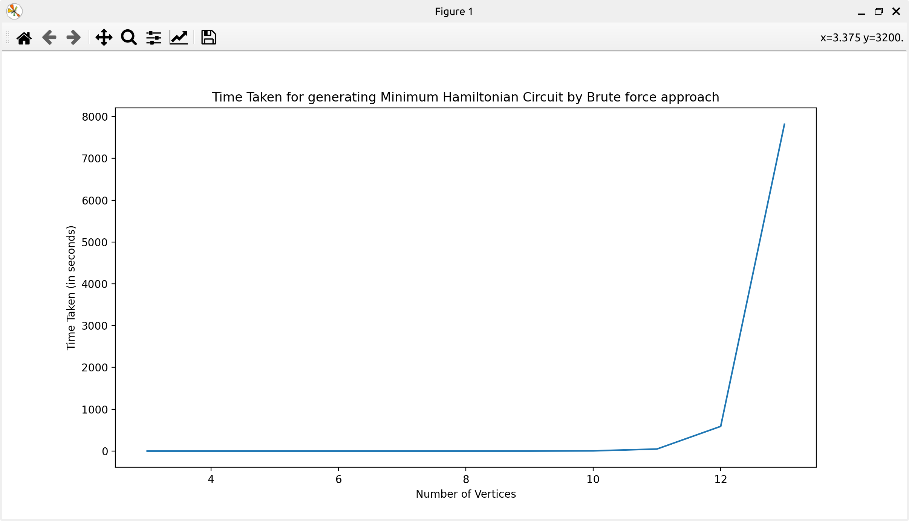
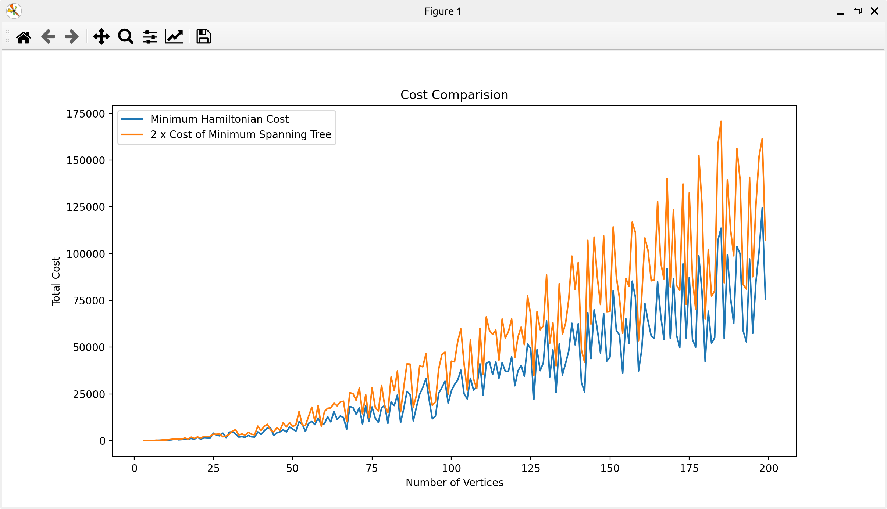

# CSPE32 Project

### Language used
 -The project is entirely done in Python.
 
## Project Description

### Minimum Spanning Tree
 -Prim's Algorithm: A vertex is chosen as the starting node in a graph with n vertices. The cheapest edge at the vertex is added to the tree. Next, the algorithm looks for the next cheapest edge connected to the vertices in the tree and checks if a cycle is formed in the tree. If a cycle is formed, it does not add the edge to the tree and goes for the next cheapest edge. Else, it adds the edge and new vertex to the tree and looks for the next cheapest edge. This process ends when there are n-1 edges in the tree. Time complexity is O(n^2).
 
 -Kruskal's Algorithm: The edges in the graph with n vertices are sorted and the two cheapest edges is added to the tree. Next, the next cheapest edge is selected and it checks if a cycle is formed. If it is, then the edge is not added and algorithm moves to the next edge. If not, then the edge is added and the next edge is taken. This process ends when there are n-1 edges in the tree. Time complexity is O(eloge) where e is the number of edges in the graph.
 \
 

 ### Bruteforce algorithm to find Minimum Hamiltonian cycle in complete graph
 -This algorithm finds every hamiltonian cycle and its weight and displays the Hamiltonian Cycle with the least weight.\
 \
 
 
 ### Bruteforce Vertices vs Time
 -The bruteforce algorithm is not advised for finding minimum hamiltonian graph due to the time complexity being O(n!) since there are (n-1)!/2 possible hamiltonian cycles for a complete graph.
 
 
 ### Minimum Hamiltonian cycle in graph that satisfies triangle inequalities
 -It is an approximation algorithm. The algorithm calculates the minimum spanning tree. It then selects a vertex as the starting node arbitrarily and adds all the visited nodes in a list using depth first search (DFS). Then it lists the hamiltonian cycle in the order of the vertices present in the list. The algorithm takes polynomial time.
 
 -The triangular inequality graph also satisfies the condition:\
 2 * cost of minimum spanning tree > minimum hamiltonian path.
 
 
 
### Credits
 -Bharat Jude Johnson-106121027,\
 -Nitish N-106121087,\
 -R Pranav Kumar-106121109,\
 -Venkatesh A-106121141.
